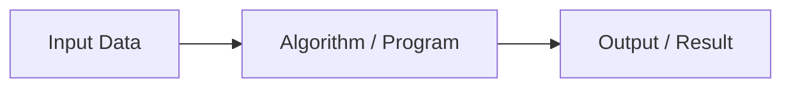

# CS50x 2026 - Lecture 0: Scratch

> *“Learn to think computationally. Use AI as a copilot, not a replacement.”*

---

## 1. What is CS50?
- Harvard’s legendary introduction to **Computer Science**.
- Focus: **Problem-solving mindset** > memorizing syntax.
- Goal: Understand **how computers work** and how to instruct them effectively.
- AI tools (like Grok or ChatGPT) are powerful, but **fundamentals** let you direct them wisely.

**Key Mindset**: You are the **pilot** — AI is the copilot.

---

## 2. Core Idea of Computing
**Input → Black Box (Algorithm) → Output**

- Computers only understand **binary** (0s and 1s).
- Everything (text, images, sound, video) is represented as binary.

---

## 3. Data Representation

### Binary (Base-2)
- **Bit** = 0 or 1 (on/off).
- **Byte** = 8 bits (256 possible values: 0–255).

**Example Table** (3 bits):

| 4 (2²) | 2 (2¹) | 1 (2⁰) | Decimal |
|--------|--------|--------|---------|
| 0      | 0      | 0      | 0       |
| 0      | 0      | 1      | 1       |
| 0      | 1      | 0      | 2       |
| 1      | 1      | 1      | 7       |

### Text Encoding
- **ASCII**: Maps characters to numbers (e.g., 'A' = 65).
- **Unicode**: Modern standard supporting emojis, global languages (😊).

### Images & Colors
- **RGB**: Each pixel = Red + Green + Blue (0–255 each).
- Image = Grid of pixels.
- Video = Sequence of images (flipbook at 24+ FPS).

**Illustration**: The same binary data can represent text **or** colors depending on interpretation.

---

## 4. Algorithms & Efficiency
- **Algorithm** = Precise step-by-step instructions.
- **Efficiency** matters for large inputs.

**Phone Book Search Example**:
- **Linear Search**: Check one by one → Slow (O(n)).
- **Binary Search**: Halve the space each time → Fast (O(log n)).

**Big-O Notation**: Describes how runtime grows with input size.

---

## 5. Pseudocode
Write logic in plain English before coding.

**Binary Search Pseudocode**:
1. Pick up phone book
2. Open to middle page
3. If person found → Call them
4. Else if person is earlier → Search left half
5. Else → Search right half
6. Repeat until found or no pages left

**Building Blocks**:
- Functions
- Conditionals (`if` / `else`)
- Loops (`repeat`)
- Boolean logic (`true` / `false`)

---

## 6. Scratch – Visual Programming (MIT)
- **Drag-and-drop** blocks → No syntax errors.
- Teaches core programming concepts visually.
- Perfect bridge to text-based languages (C, Python, etc.).

### Core Concepts in Scratch (and all languages)
- **Sprites** (characters/actors)
- **Events** (e.g., “when green flag clicked”)
- **Loops** (`repeat`, `forever`)
- **Conditionals** (`if` / `else`)
- **Variables** (memory storage)
- **Functions** / Custom blocks (abstraction)
- **Concurrency** (multiple scripts running)

**Key Takeaway**: Programming is about **logic and creativity**, not just typing code.

---

## 7. Abstraction
- Hiding complexity behind simple interfaces.
- We build on layers created by others (libraries, APIs, Scratch blocks).

---

## Summary – What I Learned
- Computers reduce **everything** to 0s and 1s.
- **Computational thinking** solves real-world problems.
- Master fundamentals → Leverage AI effectively.
- Next: Complete **Problem Set 0** in Scratch!

---
